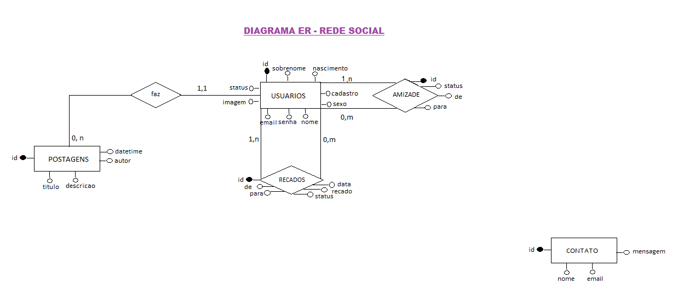
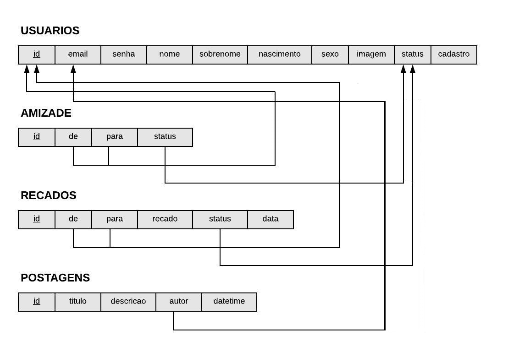
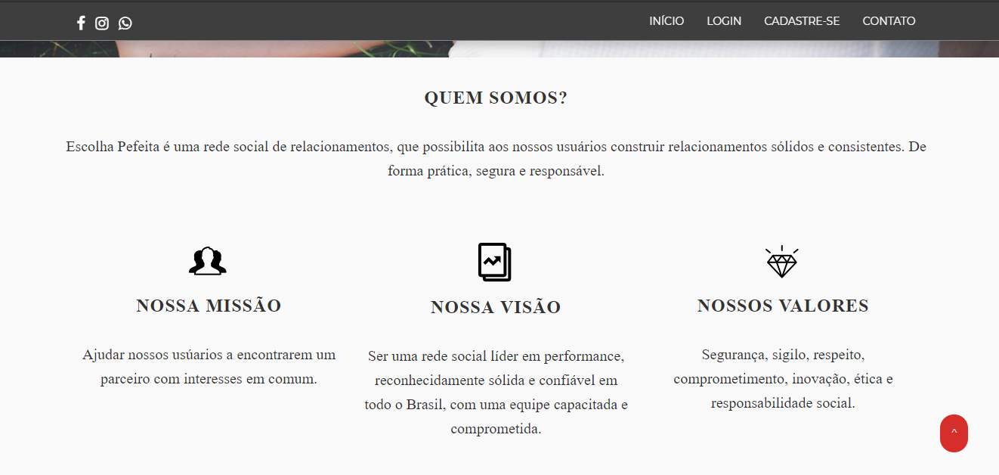
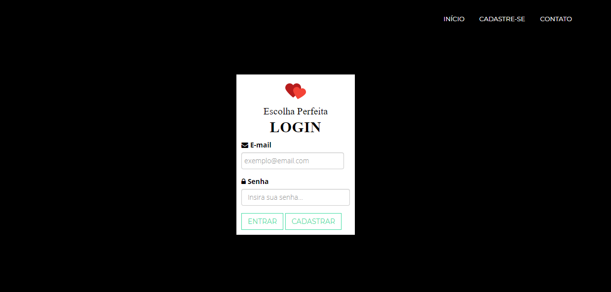
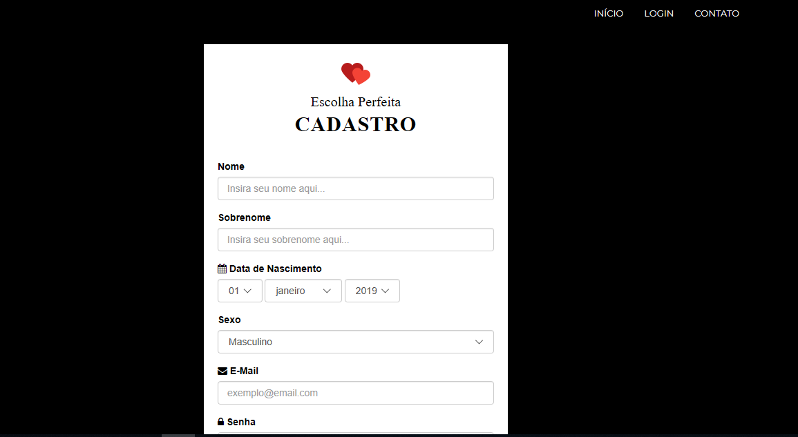
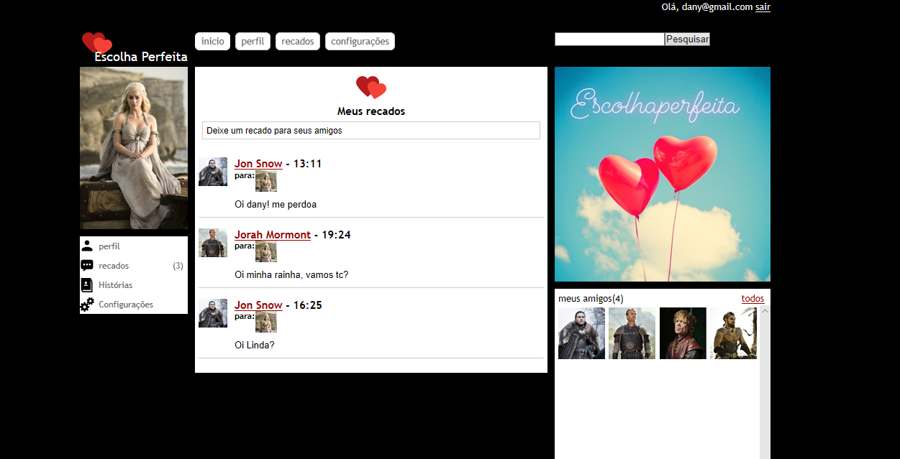

     

# Trabalho de banco de dados

O presente projeto é uma atividade acadêmica que visa apresentar o diagrama Entidade-Relacionamento, o mapeamento do esquema ER e a representação visual do esquema relacional do sistema web desenvolvido da rede social Escolha Perfeita. 

O SGBD utilizado para a criação da rede social foi o MySQL, tendo como servidor local o XAMPP e a ferramenta utilizada para administrar o banco de dados foi o PhpMyAdmin. As linguagens e as tecnologias utilizadas para a criação do sistema web foram as seguintes: PHP, CSS (Bootstrap), HTML, JavaScript (jQuerry), HTML5 e interface de programação Visual Studio Code.

## Diagrama relacional

Diagrama Relacional

Esquema Relacional

## Prints

# Licença

Este projeto está sob licença [MIT](https://choosealicense.com/licenses/mit/) © 2020 Adriana Mirian Mendes Cardoso. 

Para mais informações acesse o arquivo :scroll:`LICENSE.md`.

# Contato

:email: E-Mail: ​[adriana.cardoso@aluno.ufop.edu.br](adriana.cardoso@aluno.ufop.edu.br) 

:clipboard: Linkedin: ​[https://www.linkedin.com/in/adriana-mendes-engenheira-de-computacao/](https://www.linkedin.com/in/adriana-mendes-engenheira-de-computacao/)

:package: GitHub:  [https://github.com/AdrianaMendes](https://github.com/AdrianaMendes)